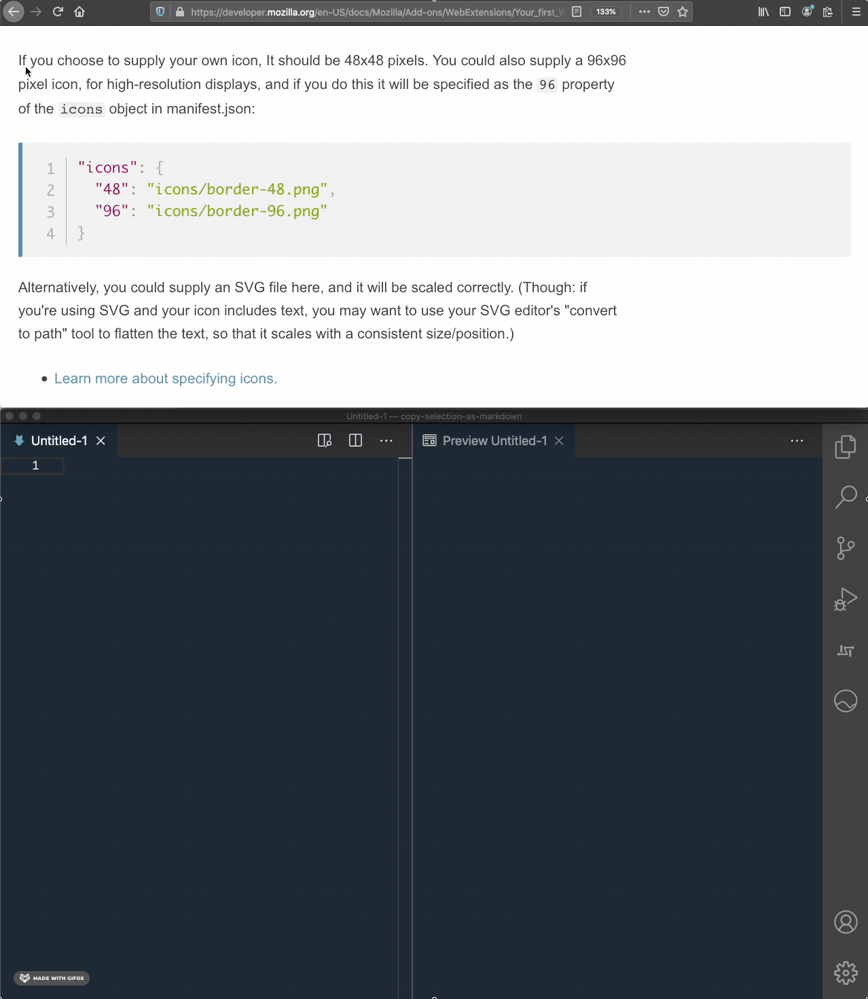

# Copy Selection as Markdown

Copy title, URL, selection as Markdown

> [!NOTE]
> This extension isn't abandoned; it's in maintenance mode because its current state is stable and feature-complete for my needs (I use it every hour). I don't plan to add new features or make major changes, except for the update to manifest V3, which might be the last update. I may address critical issues as they arise, but other issues may not be resolved. Thanks!



## Install

- Mozilla Firefox: Go to [Add-ons for Firefox](https://addons.mozilla.org/en-US/firefox/addon/copy-selection-as-markdown/) and install.
- Google Chrome: You have to build and install at your own risk. No store distribution at this moment.

## Usage

Right click and select:

- when part of the page is selected: **Copy Selection as Markdown**
- when user context-clicks in the page: **Copy Title and URL as Markdown** (only available on Firefox)
- when user context-clicks in the link: **Copy Link as Markdown** (only available on Firefox)

Toolbar button is also available.

Since v0.18.0, rich text (`text/html`) version of the selection will be copied to the clipboard as well. Almost all of users of this extension might be using plain text editor, but it should be useful for using with [Slack](https://slack.com).

## Settings

The add-on has multiple configuration to suit your setup as follows. Set your preference by:

- Firefox:
  1. Click the menu button  and choose  **Add-ons**. The Add-ons Manager tab will open
  2. In the Add-ons Manager tab, select the **Extensions** panel
  3. Click **Copy Selection as Markdown** and click **Preferences** tab
  4. Hit **Save** button on the top to apply changes (no restart required)
- Chrome:
  1. Go to `chrome://extension`
  2. Click **Copy Selection as Markdown** and click **Details** tab
  3. Click **Extension options**
  4. Hit **Save** button on the top to apply changes (no restart required)

### General

- Prepend quote (<code>&gt;</code>) to selection
- Include link to source web page in the beginning of copied text
- Enable experimental MathJax support
- Disable link styling (`like this (https://example.com)` instead of `[like this](https://example.com)`)

### Shortcut Key

- macOS: `Command` + `Shift` + `E`
- Windows/Linux: `Ctrl` + `Shift` + `E`

To change shortcut key, click gear icon on top-right and click **Manage Extension Shortcuts**, or `chrome://extensions/shortcuts`.

### Markdown Styles

- Enable <a href="https://github.github.com/gfm/">GitHub Flavored Markdown</a> (strikethrough, tables, and taskListItems) support
- Use `img` tag for image instead of ``
- Reduce padding spaces for list items
- Replace `<>` with HTML entities

#### Heading style

- Setext
  ```
  Heading 1
  =========
  Heading 2
  ---------
  ```
- ATX (default)
  ```
  # Heading 1
  ## Heading 2
  ```

#### Bullet list marker

- Minus (`-`) (default)
  ```
  - one
  - two
  - three
  ```
- Plus (`+`)
  ```
  + one
  + two
  + three
  ```
- Asterisk (`*`)
  ```
  * one
  * two
  * three
  ```

#### Code block style

- Indented (default)
  ```
          let code = "indented";
  ```
- Fenced
  ````
      ```
      code = "fenced";
      ```
  ````

#### Fence

- Backticks (```) (default)
  ````
      ```
      let code = "fenced";
      ```
  ````
- Tildes (`~`)
  ```
      ~~~
      let code = "fenced";
      ~~~
  ```

#### Em

- Underline (`_`) (default)
  ```
  _Em_
  ```
- Asterisk (`*`)
  ```
  *Em*
  ```

#### Strong

- Underlines (`__`)
  ```
  __Strong__
  ```
- Asterisks (`*`) (default)
  ```
  **Strong**
  ```

#### Link style

- Inlined (default)
  ```
  [Inlined](https://example.com)
  ```
- Referenced
  ```
  [Referenced][1]<br/>
  [1]: https://example.com
  ```

#### Link reference style

- Reference (default)

  ```
  [Reference][1]

  [1]: https://example.com
  ```

- Collapsed

  ```
  [Reference with collapsed style][]

  [Reference with collapsed style]: https://example.com
  ```

- Shortcut

  ```
  [Reference with shortcut style]

  [reference with shortcut style]: https://example.com
  ```

### Advanced

- Title Substitution -- line separated texts which will be removed from title text. (supports [regular expressions](https://regex101.com/) if the line starts and ends with `/` e.g. `/^number:\d$/`. Please escape `|` with `\`.) If you add ` - Mozilla | MDN` to the textbox, the copied text wil be:
  - From `[Add-ons - Mozilla | MDN](https://developer.mozilla.org/en-US/docs/Mozilla/Add-ons)`
  - To `[Add-ons](https://developer.mozilla.org/en-US/docs/Mozilla/Add-ons)`
- Embed `img`s (.gif, .jpg, .jpeg, .png, and .webp) as base64 -- images will be encoded as base64 text, instead of URL, and added at the end of copied text. Sometime it might fail but useful for backup. See [Permissions](#privacy).

## Contributing

Please read [CONTRIBUTING](docs/CONTRIBUTING.md) for details.

## FAQ: Not working on Mozilla related sites

By default, no add-on can interfere pre-configured domains for security reason.  You can configure this behavior at either of

- `about:config` → `extensions.webextensions.restrictedDomains` preference. See [Configuration Editor for Firefox | Firefox Help](https://support.mozilla.org/en-US/kb/about-config-editor-firefox) for how to change the preference.
- Starting with Firefox 116, you can also control this behavior for this extension in the Add-ons Manager. See [Why are some add-ons not allowed on sites restricted by Mozilla? | Firefox Help](https://support.mozilla.org/en-US/kb/quarantined-domains?as=u&utm_source=inproduct) for how to change the preference.

Default list of restricted domains (See [modules/libpref/init/all.js](https://searchfox.org/mozilla-central/source/modules/libpref/init/all.js#3147)) as of 2023-08-21:

  - accounts-static.cdn.mozilla.net
  - accounts.firefox.com
  - addons.cdn.mozilla.net
  - addons.mozilla.org
  - api.accounts.firefox.com
  - content.cdn.mozilla.net
  - discovery.addons.mozilla.org
  - install.mozilla.org
  - oauth.accounts.firefox.com
  - profile.accounts.firefox.com
  - support.mozilla.org
  - sync.services.mozilla.com

## License

This extension is released under the MIT License. See [LICENSE](LICENSE) for details.

## Acknowledgements

- [Turndown](https://github.com/domchristie/turndown), which does all the heavy lifting from HTML to markdown
- [Octicons](https://octicons.github.com/) [clippy](https://octicons.github.com/icon/clippy/)

## Privacy

The add-on does not store any user data outside of the Firefox user profile. The conversion to markdown is solely done locally. The add-on never send user action/data to any server.

### Permissions

See [permissions - Mozilla | MDN](https://developer.mozilla.org/en-US/docs/Mozilla/Add-ons/WebExtensions/manifest.json/permissions) for more detail.

| Permission       | Optional | Description                                                                                                                                                                                                                                                                                                                                                       |
| ---------------- | :------: | ----------------------------------------------------------------------------------------------------------------------------------------------------------------------------------------------------------------------------------------------------------------------------------------------------------------------------------------------------------------- |
| `activeTab`      |          | to run copy functionality at active tab                                                                                                                                                                                                                                                                                                                           |
| `clipboardWrite` |          | to write to clipboard obviously                                                                                                                                                                                                                                                                                                                                   |
| `contextMenus`   |          | to add context menus                                                                                                                                                                                                                                                                                                                                              |
| `storage`        |          | to store preferences                                                                                                                                                                                                                                                                                                                                              |
| `<all_urls>`     |    X     | when [**Embed <code>img</code>s (.gif, .jpg, .jpeg, .png, and .webp) as base64 text as possible** option](#advanced) is set, the extension requests this permission since sometimes referenced images are hosted other than current active tab's URL so `activeTab` permission is not sufficient. If the option's not set, the extension removes this permission. |
